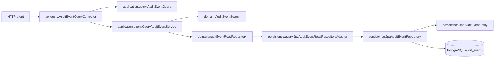

# Query API Dependency Map

This map captures the read path for audit-event queries, including optional `actor`, time, `action`, and `outcome` filters.

## Query Path

## Inbound Edges

`AuditEventQueryController` is entered only by `GET /api/v1/audit-events`.

`QueryAuditEventService` is called by `AuditEventQueryController`.

## Outbound Edges

`AuditEventQueryController` creates `AuditEventQuery` and delegates to `QueryAuditEventService`.

`QueryAuditEventService` creates `AuditEventSearch` and delegates to `AuditEventReadRepository`.

`JpaAuditEventReadRepositoryAdapter` builds read-only JPA specifications and calls `findAll`.

## Boundary To Append Path

The query path must not import or call:

- `api.append.AuditEventAppendController`
- `application.append.AppendAuditEventService`
- `application.append.AppendAuditEventCommand`
- `persistence.append.JpaAuditEventAppendRepositoryAdapter`
- `save`, `persist`, `merge`, `remove`, or `delete` methods

The append boundary is intentionally explicit so query changes stay inside the read path.
